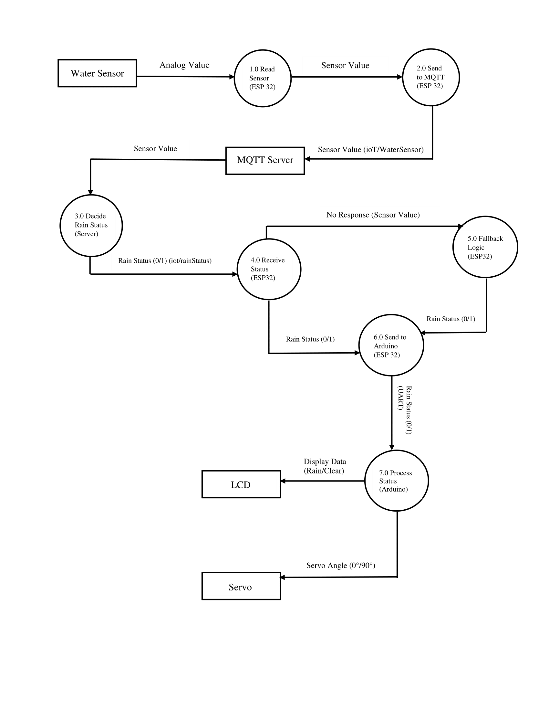

# Auto Shade

An IoT-based rain detection system that uses an ESP32, water sensor, MQTT communication, and an Arduino Uno to automatically display weather status on an LCD and control a servo-based shade mechanism.

## Table of Contents
- [Features](#features)
- [Workflow](#workflow)
- [Circuit Diagram](#circuit-diagram)
- [Pictures](#pictures)
- [Usage](#usage)
- [Documentation](#documentation)
- [Technologies Used](#technologies-used)
- [Contributing](#contributing)

## Features
- **Rain Detection**: Reads analog input from a water sensor to determine rain levels.
- **MQTT Communication**: Publishes sensor data and subscribes to rain status from an MQTT broker.
- **Fallback Logic**: Uses local decision-making when Wi-Fi or server is unavailable.
- **UART Communication**: Transfers status from ESP32 to Arduino Uno.
- **LCD Display**: Displays real-time weather status (`Rain Detected` / `Clear Weather`).
- **Automatic Shade Control**: Controls a servo motor to open or close a shade based on weather.

## Workflow
1. ESP32 reads water level using GPIO34.
2. Sensor value is sent to public MQTT broker (`broker.hivemq.com`) on topic `iot/waterSensor`.
3. Server or Python script evaluates:
   - Sensor value > 200 → `"1"` (Rain)
   - Sensor value ≤ 200 → `"0"` (Clear)
4. ESP32 receives this status from topic `iot/rainStatus`.
5. If MQTT response is not received within 3 seconds, fallback logic is used locally.
6. ESP32 sends final status via UART to Arduino Uno.
7. Arduino displays the status on a 16x2 LCD and moves an SG90 servo to:
   - **0° (Closed)** if raining
   - **70° (Open)** if clear

## Circuit Diagrams

## Pictures

## Usage
### ESP32 Firmware
1. Open `esp32_rain_mqtt_uart.ino` in Arduino IDE.
2. Install required libraries:
   - `WiFi.h`
   - `PubSubClient.h`
3. Set your Wi-Fi credentials in the code.
4. Upload the code to your ESP32 board.

### Arduino Uno
1. Open `arduino_lcd_servo.ino` in Arduino IDE.
2. Install required libraries:
   - `Servo.h`
   - `LiquidCrystal.h` or `LiquidCrystal_I2C.h`
3. Upload to your Arduino Uno board.

### Python MQTT Server Script
1. Run `mqtt_rain_classifier.py` (requires `paho-mqtt`)
2. This script reads incoming sensor values and publishes `"1"` or `"0"` as rain status.

### Wiring Notes
- ESP32 TX2 (GPIO17) → Arduino RX0
- Water Sensor Analog Output → ESP32 GPIO34
- Ensure **common GND** between ESP32 and Arduino

## Documentation
For a detailed overview of the project, refer to the [Documentation](./documentation) in the repository.

## Technologies Used
- ESP32 DevKit V1
- Arduino Uno
- Python (for MQTT server logic)
- MQTT (broker.hivemq.com)
- Water Sensor (analog)
- SG90 Servo Motor
- 16x2 LCD Display
- UART Serial Communication

## Contributing
Contributions, issues, and feature requests are welcome!  
Feel free to check out the [issues page](https://github.com/miansaadtahir/IOT-AutoShade/issues) for more information.
